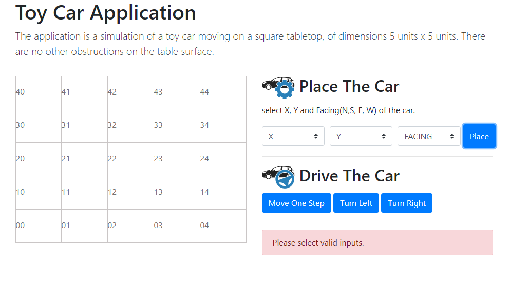

# Toy Car App using Symfony Frontend and Backend(API)

The application is a simulation of a toy car moving on a square tabletop, of
dimensions 5 units x 5 units. There are no other obstructions on the table surface.

The car is free to roam around the surface of the table, but must be prevented from
falling to destruction. Any movement that would result in the car falling from the
table must be prevented, however further valid movement commands must still be
allowed.

## Installation

- drop the project in your localhost folder/ docker conainer and access the project with url.

## Home Screen


## Technology
- PHP Symfony Open source Framework
- Symfony FOSUserBundle
- Bootstap
- CSS, Jquery and jaavscript 


## WorkFlow
- API is buid with using Syumfony standard http components
- Front end is build with using Bootstap Javascript CSS and JQuery 
- to strat playing with the toy Car you need to select X,Y and F (Facing, e.g. North)
- once you initialize the starting point you can see that car is visible on the starting point you selevted 
- and then you can use, Move 1 Step, Move Left Move Right Comands to move car around the table cloth
- if you try to move the car out of the table clothes you wil get warnings.


### Preview
## Screencast one


## Screencast two


## Screencast three


## Screencast mobile


## API Endpoints
### GET
##### Place The Car
```yaml
'POST' the-car-on-the-table/public/api/place
```

##### request
```yaml
{
    "x": "0",
    "y": "1",
    "f": "N"
}
```
##### response
```yaml
{
    "x": "0",
    "y": "1",
    "f": "N"
}
```
##### Move Car
```yaml
'POST' the-car-on-the-table/public/api/move
```
##### Request
```yaml
{
    "x": "1",
    "y": "1",
    "f": "W"
}
```
##### response
```yaml
{
    "x": "1",
    "y": 0,
    "f": "W"
}
```
### POST
##### Take a Turn
```yaml
'POST' the-car-on-the-table/public/api/turn
```

##### request
```yaml
{
    "x": "0",
    "y": "3",
    "f": "N",
    "t":"L"
}
```
##### response
```yaml
{
    "x": 0,
    "y": 3,
    "f": "W"
}
```


